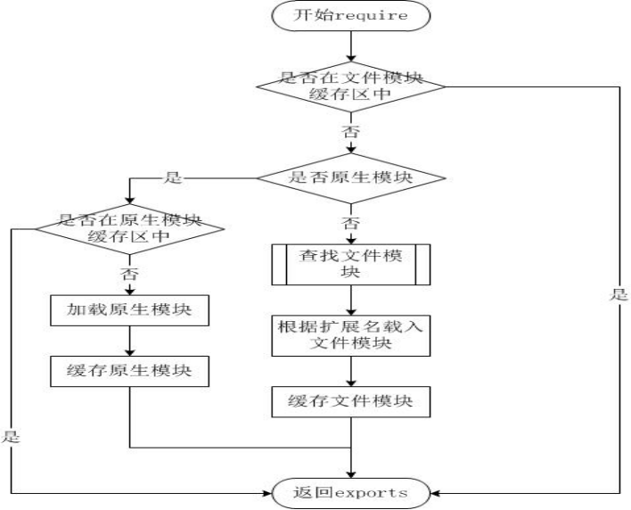

# node 模块加载和webpack resolve

+ [node module](#node)
+ [webpack resolve]()

## node模块加载机制
node的实现借鉴commonJS来实现的模块加载机制，先简单的说一下commonJS规范。commonJS规范产生的原因

>1.JavaScript没有模块系统。没有原生的支持密闭作用域或依赖管理。
2.JavaScript没有标准库。除了一些核心库外，没有文件系统的API，没有IO流API等。
3.JavaScript没有标准接口。没有如Web Server或者数据库的统一接口。
4.JavaScript没有包管理系统。不能自动加载和安装依赖。

### commonJS
commonJS 对模块的定义很简单，就是模块引用，模块定义，模块标识符
> 1.模块引用
>  ``` javascript
>  require('xxx')
>  ```
> 2.模块定义
>  ```javascript
>  exports.xxx
>  module.exports = {}
>  ```
>  3.模块标识
>
>  模块标识其实就是传递给`require()`方法的参数，它必须是符合小驼峰命名的字符串，或者以.、..开头的相对路径，或者绝对路径。它可以没有文件名后缀.js。
---
### node
node的模块加载是符合commomnJS规范的，node也在这基础上做一些自己的事情:

1.定义模块
```javascript
module.exports = Module;
...
function Module(id, parent) {
  this.id = id; //id也就是模块表示符，这是一个只读属性
  this.exports = {};//exports对象是对外输出接口的对象，也就是require获取的模块的对象
  this.parent = parent;
  updateChildren(parent, this, false);//把该模块加到上级模块的children中
  this.filename = null;//模块的文件名，带有绝对路径
  this.loaded = false;//表示模块是否已经完成加载
  this.children = [];//表示该模块要用到的其他模块
}
...
Module._load = function(request, parent, isMain) {
  ...
  // Don't call updateChildren(), Module constructor already does.
  var module = new Module(filename, parent);
  ...
}

```
这里需要注意一下区分一下`exports`和`module.exports`
```javascript
var exports = module.exports = {}//exports是module.exports的引用
```
所以`exports.[name]`带上键值，而不能直接的`exports = function(){}`

这从源码上拷过来的,有问题可以查阅一下[https://github.com/nodejs/node/blob/master/lib/internal/modules/cjs/loader.js](https://github.com/nodejs/node/blob/master/lib/internal/modules/cjs/loader.js)

2.文件加载过程



node的模块类型分三类，分别是核心模块也就是原生模块、文件模块、自定义模块，在写引入模块的时候尽量带上文件名
