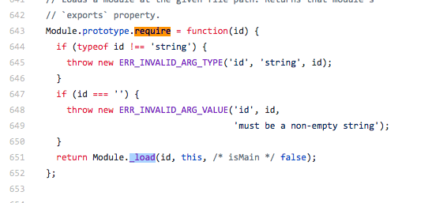
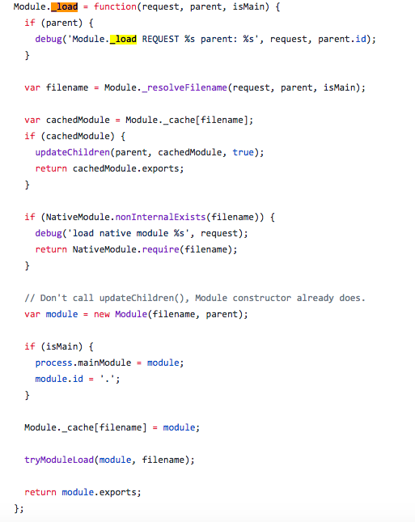

# node 模块加载和webpack resolve

+ [node module](#node)
+ [webpack resolve](##webpack)

## node模块加载机制
node的实现借鉴commonJS来实现的模块加载机制，先简单的说一下commonJS规范。commonJS规范产生的原因

>1.JavaScript没有模块系统。没有原生的支持密闭作用域或依赖管理。
2.JavaScript没有标准库。除了一些核心库外，没有文件系统的API，没有IO流API等。
3.JavaScript没有标准接口。没有如Web Server或者数据库的统一接口。
4.JavaScript没有包管理系统。不能自动加载和安装依赖。

### commonJS
commonJS 对模块的定义很简单，就是模块引用，模块定义，模块标识符
> 1.模块引用
>  ``` javascript
>  require('xxx')
>  ```
> 2.模块定义
>  ```javascript
>  exports.xxx
>  module.exports = {}
>  ```
>  3.模块标识
>
>  模块标识其实就是传递给`require()`方法的参数，它必须是符合小驼峰命名的字符串，或者以.、..开头的相对路径，或者绝对路径。它可以没有文件名后缀.js。
---
### node
node的模块加载是符合commomnJS规范的，node也在这基础上做一些自己的事情:

1.定义模块
```javascript
module.exports = Module;
...
function Module(id, parent) {
  this.id = id; //id也就是模块表示符，这是一个只读属性
  this.exports = {};//exports对象是对外输出接口的对象，也就是require获取的模块的对象
  this.parent = parent;
  updateChildren(parent, this, false);//把该模块加到上级模块的children中
  this.filename = null;//模块的文件名，带有绝对路径
  this.loaded = false;//表示模块是否已经完成加载
  this.children = [];//表示该模块要用到的其他模块
}
...
Module._load = function(request, parent, isMain) {
  ...
  // Don't call updateChildren(), Module constructor already does.
  var module = new Module(filename, parent);
  ...
}

```
这里需要注意一下区分一下`exports`和`module.exports`
```javascript
var exports = module.exports = {}//exports是module.exports的引用
```
所以`exports.[name]`带上键值，而不能直接的`exports = function(){}`

这从源码上拷过来的,有问题可以查阅一下[https://github.com/nodejs/node/blob/master/lib/internal/modules/cjs/loader.js](https://github.com/nodejs/node/blob/master/lib/internal/modules/cjs/loader.js)

2.文件加载过程


node的模块类型分三类，分别是核心模块也就是原生模块、文件模块、自定义模块，在写引入模块的时候尽量带上文件名

3.require方法



根据_load(id)加载模块



先通过`Module._cache[filename]`查看缓存是否有该模块，然后根据`NativeModule.nonInternalExists(filename)`判断是否是原生模块，之后才会根据路径加载，最后`return module.exports`.这里是根据_resolveFilename这个方法去解析路径和扩展名的
```javascript
  var module = new Module(filename, parent);
  if (isMain) {
    process.mainModule = module;
    module.id = '.';
  }
  Module._cache[filename] = module;//存入缓存
  tryModuleLoad(module, filename);//加载模块
  return module.exports;
```
tryModuleLoad方法，然后用module.load去加载模块
```javascript
function tryModuleLoad(module, filename) {
  var threw = true;
  try {
    module.load(filename);//加载模块
    threw = false;
  } finally {
    if (threw) {
      delete Module._cache[filename];//加载失败删除缓存
    }
  }
}
```
从代码中解析是这么一个加载的过程

## webpack resolve

resolver 是一个库(library)，用于帮助找到模块的绝对路径。一个模块可以作为另一个模块的依赖模块，然后被后者引用，如下：
```javascript
import foo from 'path/to/module';
// 或者
require('path/to/module');

```
### webpack 中的解析规则
使用 `enhanced-resolve`，`webpack` 能够解析三种文件路径：

1. 使用 enhanced-resolve，webpack 能够解析三种文件路径：
```javascript
import '/home/me/file';
import 'C:\\Users\\me\\file';
```
由于我们已经取得文件的绝对路径，因此不需要进一步再做解析。
2. 相对路径
```javascript
import 'module';
import 'module/lib/file';
```
模块将在`resolve.modules`中指定的所有目录内搜索。 你可以替换初始模块路径，此替换路径通过使用`resolve.alias`配置选项来创建一个别名。

一旦根据上述规则解析路径后，解析器(resolver)将检查路径是否指向文件或目录。如果路径指向一个文件：

+ 如果路径具有文件扩展名，则被直接将文件打包。
+ 否则，将使用 [`resolve.extensions`] 选项作为文件扩展名来解析，此选项告诉解析器在解析中能够接受哪些扩展名（例如 `.js`, `.jsx`）

如果路径指向一个文件夹，则采取以下步骤找到具有正确扩展名的正确文件：

+ 如果文件夹中包含`package.json`文件，则按照顺序查找`resolve.mainFields`配置选项中指定的字段。并且`package.json`中的第一个这样的字段确定文件路径。
+ 如果`package.json`文件不存在或者`package.json`文件中的 main 字段没有返回一个有效路径，则按照顺序查找`resolve.mainFiles`配置选项中指定的文件名，看是否能在`import/require`目录下匹配到一个存在的文件名。
+ 文件扩展名通过`resolve.extensions`选项采用类似的方法进行解析。

webpack 根据构建目标(build target)为这些选项提供了合理的默认配置。

3. 解析 Loader(Resolving Loaders)
`Loader`解析遵循与文件解析器指定的规则相同的规则。但是`resolveLoader`配置选项可以用来为 Loader 提供独立的解析规则。

4. 缓存
每个文件系统访问都被缓存，以便更快触发对同一文件的多个并行或串行请求。在观察模式下，只有修改过的文件会从缓存中摘出。如果关闭观察模式，在每次编译前清理缓存。


#### resolve.alias
创建 import 或 require 的别名，来确保模块引入变得更简单。
```javascript
module.exports = {
  //...
  resolve: {
    alias: {
      Utilities: path.resolve(__dirname, 'src/utilities/'),
      Templates: path.resolve(__dirname, 'src/templates/')
    }
  }
};

//引用方式1
import Utility from '../../utilities/utility';
//引用方式2
import Utility from 'Utilities/utility'; //可以用别名替换引用方式1

```

也可以为对象的健值末尾加上`$`，来表示精准匹配
```javascript
module.exports = {
  //...
  resolve: {
    alias: {
      xyz$: path.resolve(__dirname, 'path/to/file.js')
    }
  }
};

//结果
import Test1 from 'xyz'; // 精确匹配，所以 path/to/file.js 被解析和导入
import Test2 from 'xyz/file.js'; // 非精确匹配，触发普通解析

```
| 别名：	| import "xyz" |	import "xyz/file.js" |
|------- | ------------ | ----------------------|
|{}      |/abc/node_modules/xyz/index.js| /abc/node_modules/xyz/file.js|
|{ xyz: "/abs/path/to/file.js" }|/abs/path/to/file.js|error|
|{ xyz$: "/abs/path/to/file.js" }|/abs/path/to/file.js|/abc/node_modules/xyz/file.js|
|{ xyz: "./dir/file.js" }|/abc/dir/file.js|error|
|{ xyz$: "./dir/file.js" }|/abc/dir/file.js|/abc/node_modules/xyz/file.js|
|{ xyz: "/some/dir" }|/some/dir/index.js|/some/dir/file.js|
|{ xyz$: "/some/dir" }|/some/dir/index.js|/abc/node_modules/xyz/file.js|
|{ xyz: "./dir" }|/abc/dir/index.js|/abc/dir/file.js|
|{ xyz: "modu" }|/abc/node_modules/modu/index.js|/abc/node_modules/modu/file.js|
|{ xyz$: "modu" }|/abc/node_modules/modu/index.js|/abc/node_modules/xyz/file.js|
|{ xyz: "modu/some/file.js" }|/abc/node_modules/modu/some/file.js|error|
|{ xyz: "modu/dir" }|/abc/node_modules/modu/dir/index.js|/abc/node_modules/dir/file.js|
|{ xyz: "xyz/dir" }|/abc/node_modules/xyz/dir/index.js|/abc/node_modules/xyz/dir/file.js|
|{ xyz$: "xyz/dir" }|/abc/node_modules/xyz/dir/index.js|/abc/node_modules/xyz/file.js|